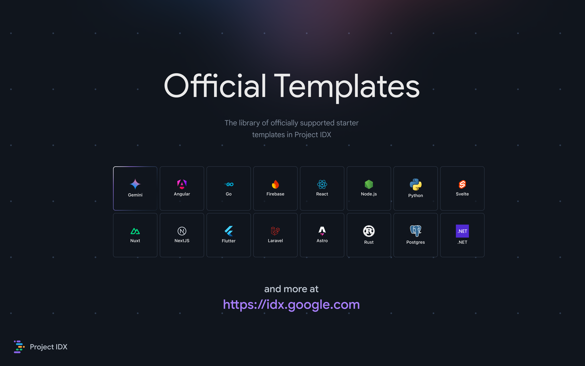

<h1 align="center">Firebase Studio Official Templates</h1>

A library of templates to get you started faster and explore tools, frameworks, and runtimes.

## Want us to support a template?
First, check out our [Community Template Repository](https://github.com/project-idx/community-templates) to see if the template already exists. If you want us to officially support a template, create a post in our [community discourse](https://community.idx.dev) for us to support an official template.

## Open this repository in IDX
Want to make a PR? Open this repository in IDX.

## IDX template documentation
See our [documentation for details on how templates work](https://developers.google.com/idx/guides/custom-templates) and how you can build your own. 
